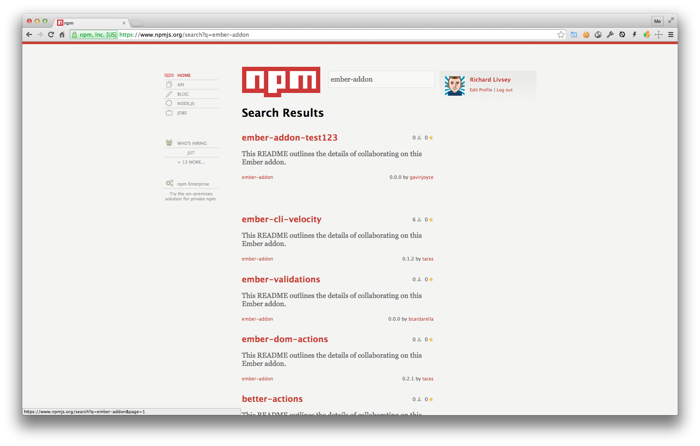
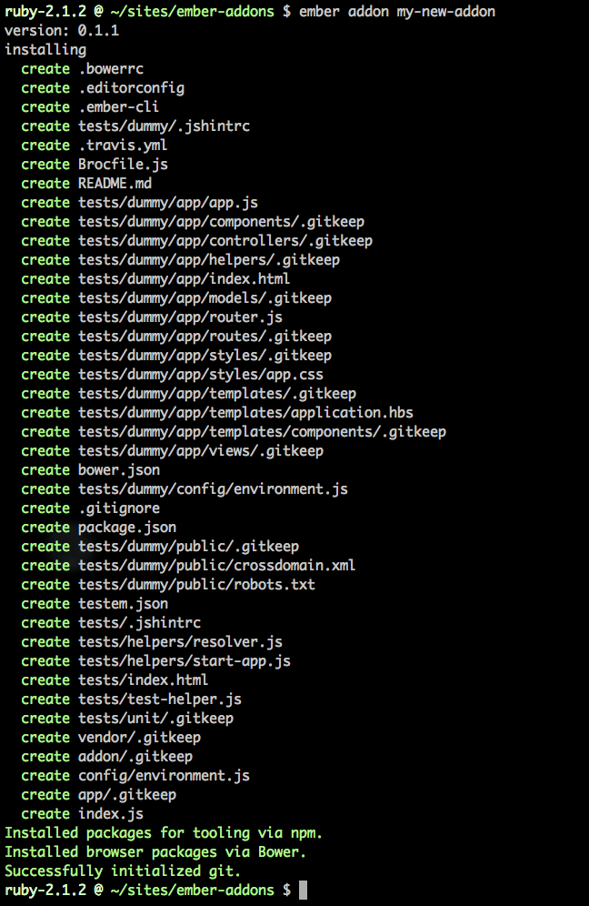

#[fit] Ember CLI
#[fit] Addons

---

# Ember CLI?

---

> Ember CLI stands in the very same point that Rails did a decade ago.
-- [Miguel Camba](http://miguelcamba.com/blog/2014/09/28/why-i-believe-that-ember-cli-is-a-game-changer/) - Why I believe that Ember CLI is a game-changer

---

# What can you do with an addon?

* Add routes, controllers, views, components etc...
* Development server middleware
* Blueprints / generators
* Configuration
* Commands
* Modify built assets
* Update build output
* Pre-processors

---

# Finding Addons

```javascript
// /package.json
{
  "name": "ember-cli-divshot",
  "version": "0.1.4",
  "keywords": [
    "ember-addon"
  ]
}
```

---



---

# Installing an Addon

Install it.

```
$ npm install --save-dev ember-sanitize
$ ember generate ember-sanitize
```

Use it.

```handlebars
<h1>
  {{sanitize-html title}}
</h1>
```

---

# Creating an addon

```
$ npm install -g ember-cli

$ ember addon my-new-addon
```



---

# What goes where?

* __addon__ - _/addon_
* __app__ - _/app_
* __styles__ - _/app/styles_
* __templates__ - _/app/templates_
* __vendor__ - _/vendor_
* __test-support__ - _/test-support -> /test_
* __public__ - _/public -> /dist/{addon-name}_

^ keep addon code in /addon, import re-export from /app if needed

---
```javascript
// /addon/utils/sanitize.js

function sanitizeElement(element, config) {
  var sanitizer = new Sanitize(config);
  var cleaned   = document.createElement('div');

  cleaned.appendChild(sanitizer.clean_node(element));
  return cleaned.innerHTML;
}

function sanitize(html, config) {
  var container = document.createElement('div');
  container.innerHTML = html;
  return sanitizeElement(container, config);
}

export {
  sanitize
};
```

---

```javascript
// /app/helpers/sanitize-html.js

import Ember from 'ember';
import { sanitize } from 'ember-sanitize/utils/sanitize';

export default Ember.Handlebars.
  makeBoundHelper(function(html, configName, options) {

  // ...

  var sanitized = sanitize(html, config);
  return new Ember.Handlebars.SafeString(sanitized);
});
```

---

## Importing Bower Packages

Add a generator which adds the Bower package

```javascript
// blueprints/ember-sanitize/index.js

module.exports = {
  normalizeEntityName: function() {
    // this prevents an error when the entityName is
    // not specified (since that doesn't actually matter
    // to us
  },
  afterInstall: function() {
    return this.addBowerPackageToProject('sanitize.js', '*');
  }
};
```

---

## Importing Bower Packages

Then import the bower JS into the project

```javascript
// index.js

module.exports = {
  name: 'ember-sanitize',
  included: function(app) {
    this._super.included(app);
    this.app.import(app.bowerDirectory + '/sanitize.js/lib/sanitize.js');
  }
};
```

---

# Controlling Addon Namespace

Add `/addon/index.js` to manage the entry module for the addon's namespace.

```javascript
// /addon/index.js
import injectScript from './utils/inject-script';
export default injectScript;
```

allows:

```javascript
import injectScript from 'ember-inject-script';
```

vs

```javascript
import injectScript from 'ember-inject-script/utils/inject-script';
```

---

# Controlling Addon Namespace

```javascript
import Model   from './model/model';
import attr    from './model/attr';
import hasOne  from './relationships/has-one';
import hasMany from './relationships/has-many';
import Store   from './store';
//...

export {
  Model,
  attr,
  hasOne,
  hasMany,
  Store,
  //...
};
```

---

# Controlling Addon Namespace


```javascript
import {
  Model,
  attr,
  hasOne
} from 'fireplace';
```

vs

```javascript
import Model from 'fireplace/model/model';
import attr from 'fireplace/model/attr';
import hasOne from 'fireplace/relationships/has-one';
```

---

# Hooks

```javascript
// /index.js
module.exports = {
  name: 'my-addon',
  blueprintsPath:
  config:
  contentFor:
  included:
  includedCommands:
  postBuild:
  postprocessTree:
  serverMiddleware:  
  treeFor:
};
```

---

# Hooks
## config

Returns object to merge with app config.

```javascript
module.exports = {
  name: 'ember-cli-content-security-policy',
  config: function(environment /*, appConfig */) {
    var ENV = {
      contentSecurityPolicyHeader: 'Content-Security-Policy-Report-Only',
      contentSecurityPolicy: {
        'default-src': "'none'",
        'script-src': "'self'",
        //...
      }
    }
    if (environment === 'development') {
      ENV.contentSecurityPolicy['script-src'] = ENV.contentSecurityPolicy['script-src'] + " 'unsafe-eval'";
    }
    return ENV;
  }
}
```

---

# Hooks
## contentFor

Injects HTML into `index.html`, type can be `head` or `body`.

```javascript
module.exports = {
  name: 'live-reload-middleware',
  contentFor: function(type) {
    var liveReloadPort = process.env.EMBER_CLI_INJECT_LIVE_RELOAD_PORT;
    if (liveReloadPort && type === 'head') {
      return '<script src="//localhost:' +
        liveReloadPort +
        '/livereload.js?snipver=1" type="text/javascript"></script>';
    }
  }
}
```

---

# Hooks
## include

Receives `EmberApp` instance.
Generally used to call `app.import`.

```javascript
module.exports = {
  name: 'ember-sanitize',
  included: function(app) {
    this._super.included(app);
    this.app.import(app.bowerDirectory + '/sanitize.js/lib/sanitize.js');
  }
};
```

---

# Hooks
## includedCommands

```javascript
module.exports = {
  name: 'ember-cli-divshot',
  includedCommands: function() {
    return {
      'divshot': require('./lib/commands/divshot')
    }
  }
}
```

```
$ ember divshot push
```

---

# Hooks
## postBuild

Receives build results with path to the built directory.

```javascript
module.exports = {
  postBuild: function(results) {
    // do something with results.directory
  }
}
```

---

# Hooks
## postProcessTree

Allows manipulating the final generated tree.

```javascript
module.exports = {
  name: 'ember-cli-autoprefixer',
  postprocessTree: function (type, tree) {
    if (type === 'all' || type === 'styles') {
      tree = autoprefixer(tree, this.options);
    }
    return tree;
  }
}
```

---

# Hooks
## serverMiddleware

Allows hooking into the development server's Express app.

```javascript
module.exports = {
  name: 'live-reload-middleware',
  serverMiddleware: function(config) {
    var app = config.app;
    var options = config.options;

    app.use(livereloadMiddleware({
      port: options.liveReloadPort
    }));
  }
}
```

---

# Hooks
## treeFor

* treeFor _(called for all trees)_
* treeForApp
* treeForStyles
* treeForTemplates
* treeForAddon
* treeForVendor
* treeForTestSupport
* treeForPublic

# Hooks
## treeFor

Changing default tree paths.

```javascript
// index.js

module.exports = {
  name: 'Liquid Fire',
  init: function() {
    this.treePaths.app       = 'app-addon';
    this.treePaths.templates = 'app-addon/templates';
    this.treePaths.vendor    = 'vendor-addon';
  }
}
```

---

# Testing

Ember CLI generates a dummy app in `/tests/dummy`

Used for integration tests.

Served at http://localhost:4200

Tests at http://localhost:4200/tests

---

#[fit] Questions?

